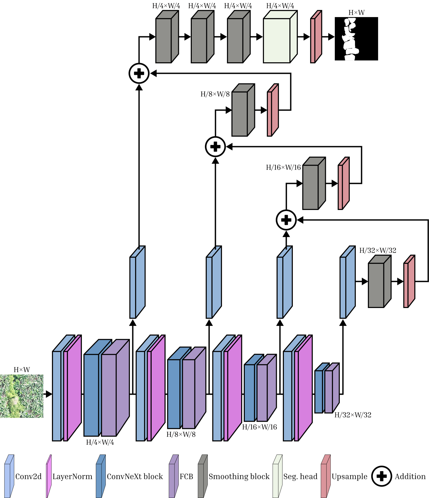

# FCBNet: A Parameter-efficient Convolutional Approach for Camouflaged Weed Detection in Multispectral Aerial Imagery

<div align="center">

[Leo Thomas Ramos](https://www.linkedin.com/in/leo-thomas-ramos/), [Angel D. Sappa](https://es.linkedin.com/in/angel-sappa-61532b17)<br/>
Correspondence: ltramos@cvc.uab.cat

Computer Vision Center (CVC), Universitat Autònoma de Barcelona (UAB), Spain

</div>

<div align="center">

</div>

## Announcements

- Official implementation and model code are available
- FCBNet paper is now available [here](https://openaccess.thecvf.com/content/CVPR2026W/SVC/html/Ramos_A_Parameter-efficient_Convolutional_Approach_for_Camouflaged_Weed_Detection_in_Multispectral_CVPRW_2026_paper.html)
- FCBNet has been accepted at the 2nd Workshop on Subtle Visual Computing (SVC), CVPR 2026

## About the project

FCBNet is a parameter-efficient semantic segmentation model for camouflaged weed detection in aerial imagery. It combines a fully frozen ConvNeXt encoder with lightweight **Feature Correction Blocks (FCB)** and an FPN-style decoder. The main design goal is to keep strong segmentation performance while drastically reducing trainable parameters and training cost.

## Installation

```bash
pip install -r requirements.txt
```

or install directly from source:

```bash
pip install .
```

## Quick usage

FCBNet can be instantiated directly from ```fcbnet.py``` and used within any training workflow as follows:

```python
from fcbnet import FCBNet

model = FCBNet(
    in_channels=3,
    num_classes=4,
)
```

The default arguments are already configured with the best-performing setup from our experiments. It can still be tuned through parameters such as `variant`, `pretrained`, `freeze_backbone`, `fpn_dim`, and the FCB-related settings if needed.

## Input and output

- **Input:** tensor of shape `(B, C, H, W)`
- **Output:** logits of shape `(B, num_classes, H, W)`

Example forward pass:

```python
import torch
from fcbnet import FCBNet

model = FCBNet(in_channels=3, num_classes=4)
x = torch.randn(2, 3, 256, 256)
y = model(x)
print(y.shape)  # (2, 4, 256, 256)
```
## Datasets

To evaluate FCBNet, we use two camouflaged weed detection/segmentation datasets based on aerial imagery:

- [**WeedBananaCOD**](https://cod-espol.github.io/COD-Weeds/)
- [**WeedMap**](https://github.com/viariasv/weedMap)

## Main results

### WeedBananaCOD

| Model | Modality | IoU_BG | IoU_W | mIoU | Inference time (s) | Training time (h) | Total params (M) | Trainable params (M) | GFLOPS |
|------|------|------|------|------|------|------|------|------|------|
| U-Net | RGB | 0.990 | 0.715 | 0.851 | 0.0243 | 0.097 | 32.521 | 32.521 | 42.771 |
| U-Net | RGB-NIR | 0.990 | 0.720 | 0.855 | 0.0257 | 0.100 | 32.524 | 32.524 | 42.976 |
| DeepLabV3+ | RGB | 0.988 | 0.721 | 0.855 | 0.0270 | 0.123 | 26.678 | 26.678 | 36.762 |
| DeepLabV3+ | RGB-NIR | 0.991 | 0.725 | 0.858 | 0.0390 | 0.125 | 26.681 | 26.681 | 36.968 |
| SegFormer | RGB | 0.989 | 0.695 | 0.842 | 0.0203 | 0.310 | 84.595 | 84.595 | 49.733 |
| SegFormer | RGB-NIR | 0.990 | 0.738 | 0.864 | 0.0295 | 0.312 | 84.598 | 84.598 | 49.784 |
| **FCBNet-tiny** | RGB | 0.990 | 0.717 | 0.853 | 0.0139 | 0.060 | 30.604 | 2.015 | 13.151 |
| **FCBNet-tiny** | RGB-NIR | 0.991 | 0.740 | 0.865 | 0.0149 | 0.062 | 30.605 | 2.015 | 13.176 |
| **FCBNet-large** | RGB | 0.991 | 0.746 | 0.868 | 0.0360 | 0.169 | 202.322 | 4.555 | 19.504 |
| **FCBNet-large** | RGB-NIR | 0.992 | 0.771 | 0.881 | 0.0381 | 0.171 | 202.325 | 4.555 | 19.554 |

### WeedMap

| Model | Modality | IoU_BG | IoU_W | mIoU | Inference time (s) | Training time (h) | Total params (M) | Trainable params (M) | GFLOPS |
|------|------|------|------|------|------|------|------|------|------|
| U-Net | RGB | 0.975 | 0.427 | 0.701 | 0.0109 | 0.119 | 32.521 | 32.521 | 30.073 |
| U-Net | RGB-NIR | 0.981 | 0.508 | 0.745 | 0.0112 | 0.126 | 32.524 | 32.524 | 30.218 |
| U-Net | RGB-NIR-RE | 0.986 | 0.550 | 0.768 | 0.0117 | 0.131 | 32.528 | 32.528 | 30.362 |
| DeepLabV3+ | RGB | 0.983 | 0.509 | 0.746 | 0.0190 | 0.161 | 26.678 | 26.678 | 25.849 |
| DeepLabV3+ | RGB-NIR | 0.984 | 0.515 | 0.749 | 0.0190 | 0.170 | 26.681 | 26.681 | 25.993 |
| DeepLabV3+ | RGB-NIR-RE | 0.986 | 0.534 | 0.760 | 0.0200 | 0.189 | 26.684 | 26.684 | 26.137 |
| SegFormer | RGB | 0.986 | 0.506 | 0.746 | 0.0177 | 0.420 | 84.595 | 84.595 | 34.116 |
| SegFormer | RGB-NIR | 0.985 | 0.532 | 0.758 | 0.0180 | 0.421 | 84.598 | 84.598 | 34.153 |
| SegFormer | RGB-NIR-RE | 0.985 | 0.535 | 0.760 | 0.0189 | 0.421 | 84.601 | 84.601 | 34.189 |
| **FCBNet-tiny** | RGB | 0.985 | 0.537 | 0.761 | 0.0095 | 0.083 | 30.604 | 2.015 | 9.247 |
| **FCBNet-tiny** | RGB-NIR | 0.986 | 0.540 | 0.763 | 0.0103 | 0.091 | 30.605 | 2.015 | 9.264 |
| **FCBNet-tiny** | RGB-NIR-RE | 0.986 | 0.543 | 0.764 | 0.0107 | 0.098 | 30.607 | 2.015 | 9.282 |
| **FCBNet-large** | RGB | 0.987 | 0.546 | 0.766 | 0.0252 | 0.201 | 202.322 | 4.555 | 13.714 |
| **FCBNet-large** | RGB-NIR | 0.986 | 0.548 | 0.767 | 0.0251 | 0.211 | 202.325 | 4.555 | 13.749 |
| **FCBNet-large** | RGB-NIR-RE | 0.987 | 0.551 | 0.769 | 0.0257 | 0.215 | 202.329 | 4.555 | 13.784 |

## Why FCBNet is efficient

- Fully frozen ConvNeXt backbone
- Lightweight Feature Correction Blocks (pointwise + depthwise convolutions)
- Compact FPN decoder and segmentation head
- Lower memory footprint and faster optimization

## Citation

If you find this work useful, please star the repository and cite:

```bibtex
@InProceedings{Ramos_2026_CVPR,
    author    = {Ramos, Leo Thomas and Sappa, Angel D.},
    title     = {A Parameter-efficient Convolutional Approach for Camouflaged Weed Detection in Multispectral Aerial Imagery},
    booktitle = {Proceedings of the IEEE/CVF Conference on Computer Vision and Pattern Recognition (CVPR) Workshops},
    month     = {June},
    year      = {2026},
    pages     = {1349-1358}
}
```

## License

Distributed under the GNU General Public License v3.0. See `LICENSE` for more information.
